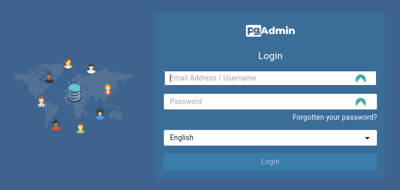
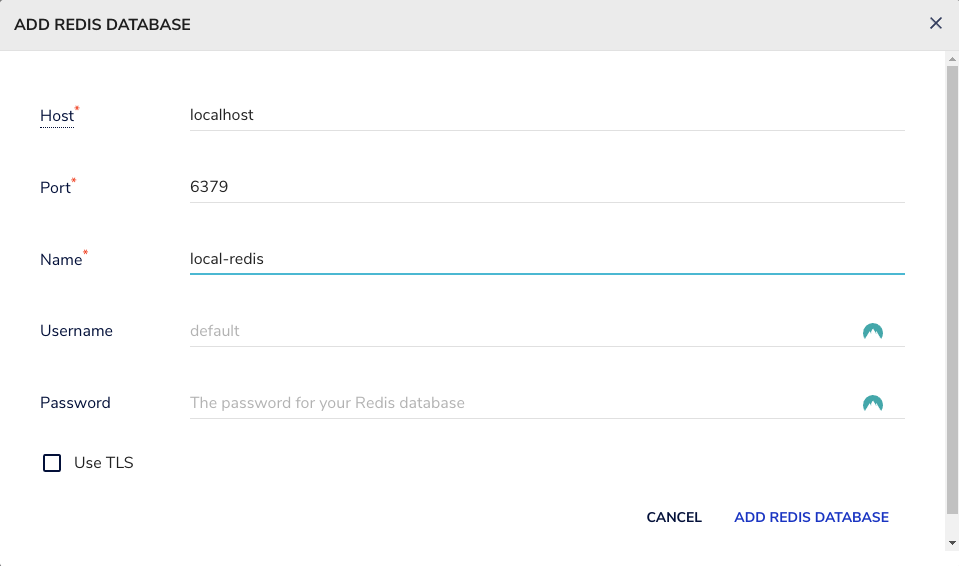

# Zipcode-API

Zipcode-API is a Spring Boot project that serves location information based on Brazilian zip codes.

The main idea behind this project is to showcase a Java application using a clean architecture and various tools, including the JDBC template, Redis caching, SpringDoc, circuit breakers, and caching mechanisms.

The API is integrated with ViaCEP to retrieve zip code information. If the information is found, the API will save the zip code in the database and return the information. If not, the API will retrieve it from the database.

## Tech Stack

### Tools and Technologies:

* [Maven](https://maven.apache.org/)
* [Spring](https://spring.io/)
* [SpringDoc-OpenApi](https://springdoc.org/)
* [Docker](https://www.docker.com/)
* [Redis](https://redis.io/)
* [Postgres](https://www.postgresql.org/)
* [Spring-CircuitBreaker-Resilience4j](https://spring.io/projects/spring-cloud-circuitbreaker)
* [ViaCEP](https://viacep.com.br/)

## Getting Started

### Pre-requirements

- Docker and Docker-Compose
- JDK 21
- Maven 3
- Makefile


```shell
git clone https://github.com/leoyassuda/zipcode-api
```

### Infrastructure Setup

This project uses Docker to set up all dependencies before running the application. <br>
In the infra folder, you'll find all the files needed for the development environment setup.

Copy and edit the example env files:
```shell
cp .env.example .env
cp .env.pgdb.primary.example .env.pgdb.primary
cp .env.pgdb.replica.example .env.pgdb.replica
cp .env.pgadmin.example .env.pgadmin
```

or 

Alternatively, you can run the copy-envs script in the root folder:
 - `.bat` for windows
 - `.sh` for linux|unix

### Database client

Database client:

- pg_admin:
  - A powerful tool for managing Postgres instances. 
  - to log in, see on the `env.pgadmin` file.
  - 

- Redis client:

- redisinsight:
  - A clean and user-friendly tool for accessing Redis instances.
  - You can use the default localhost and port for login.
  - 

## Running

Installing dependencies and building application.

```shell
make install
```

Build app image

```shell
make build-app-image  
```

Starting only infrastructure

```shell
make start-infra
```

or

To start everything
```shell
make start
```

For more available commands, check the Makefile.

## API Document

Access [http://localhost:8080/swagger-ui.html](http://localhost:8080/swagger-ui.html) to view the API documentation.

### Example: Get Address Details by Zip Code

You can retrieve address details by sending a GET request to the following endpoint:

`GET /addressDetails/zipcode/{CEP}`


Replace `{CEP}` with the Brazilian zip code you want to look up.

#### Request

To make a request using a tool like `curl`, use the following command:

```shell
curl -X GET http://localhost:8080/addressDetails/zipcode/12345678
```

Response
A successful response will return address details in JSON format, for example:
```json
{
  "id": "d2f72ace-dcfa-4143-8213-be853794e7bf",
  "zipcode": "01310-200",
  "address": "Avenida Paulista",
  "additionalAddress": "Lado ímpar",
  "neighborhood": "Bela Vista",
  "city": "São Paulo",
  "state": "SP",
  "ibge": "3550308",
  "gia": "1004",
  "ddd": "11",
  "siafi": "7107"
}
```

## Utils

Here are some useful commands:

#### create image using maven

```shell
mvn spring-boot:build-image -Dspring-boot.build-image.imageName=<docker_hub_user>/<repo>
```

#### push image

```shell
docker push <docker_hub_user>/zipcode-app
```

#### inspect using JQ

```shell
docker network inspect <network-name> | jq '.[0].IPAM.Config[0].Gateway'
```

#### export DB Ip Connection

```shell
export DB_CONNECTION_IP=$(docker network inspect <network-name> | jq -r '.[0].IPAM.Config[0].Gateway')
```

---

## Authors

- **Leo Yassuda** - _Initial work_ - [Portfolio](https://leoyas.com)
